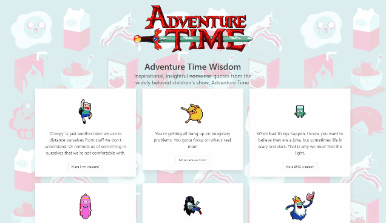

# Adventure Time Wisdom

**Live [here](https://adventure-time-wisdom.herokuapp.com/) on Heroku!** 💖

## Introduction

A small Vue app which displays meaningful quotes from one of my favorite childhood cartoons, *Adventure Time*.

The usage is simple. The page will display results of the Characters API from [Adventure Time API](https://github.com/sally/adventure-time-api) as cards. Each card will have the character's sprite and a random quote.

The random quote can be rerolled by pressing the "More (character name) wisdom?" button on each card.

## Local usage

1. Clone this repo into a location of your choosing.
2. `npm install` for project setup
3. `npm run serve` for compiling, hot-reloads for development
4. `npm run lint` for linting files

## Resources

Built using [Vue](https://vuejs.org/). Hosted by [Heroku](https://www.heroku.com/).

Adventure Time © [Cartoon Network](https://www.cartoonnetwork.com/). Logo from [StickPNG](https://www.stickpng.com/img/cartoons/adventure-time/adventure-time-logo). Tiled background from unknown*.

Powered by the CSS framework [Bulma](https://bulma.io/). CSS loading indicator from [Loading.io](https://loading.io/css/).

\* If you know who the artist is, please let me know so I can credit them here!